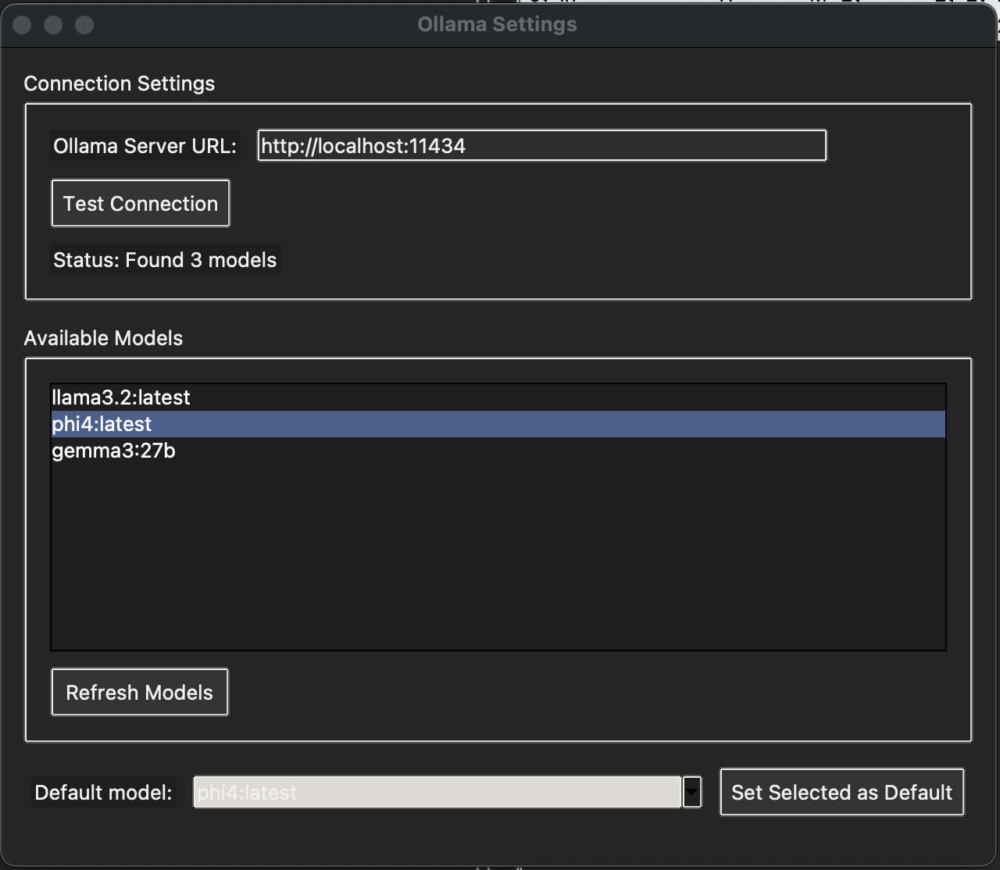

# Excel AI Assistant

A powerful desktop application that transforms your Excel and CSV data using AI, with support for both OpenAI's cloud API and local Ollama models.


## Overview

Excel AI Assistant is a Python-based desktop application that helps you apply intelligent transformations to your spreadsheet data. It seamlessly connects with OpenAI's powerful language models or your local Ollama open-source models to provide AI-driven data manipulation, cleaning, and analysis capabilities.

## Key Features

- **Load Excel and CSV files**: Easily open and manipulate your spreadsheet data
- **Intelligent Transformations**: Apply AI-powered transformations to cells and ranges
- **Dual AI Backend Options**:
  - **OpenAI API**: Use cloud-based GPT models for high-quality results
  - **Ollama Integration**: Process data locally with open-source models for privacy and cost savings
- **Column Context Understanding**: Process cells with context from other columns for more intelligent transformations
- **Row Numbering**: Clear row numbering with total row count display for better navigation
- **Auto-Save Capability**: Automatically save changes to source files after batch processing
- **Customizable Templates**: Save your favorite prompts for quick reuse
- **Batch Processing**: Apply transformations to multiple cells efficiently
- **Interactive Data View**: View, edit, and copy cell data with an intuitive interface
- **Dark/Light Mode**: Choose your preferred theme or match your system theme

## Screenshots

| Main Interface | OpenAI Settings |
|:---:|:---:|
|  |  |

| Prompt Templates | Ollama Integration |
|:---:|:---:|
|  |  |

## Installation

### Prerequisites

- Python 3.13 or higher
- `uv` package manager (installation instructions below)
- For OpenAI API: An OpenAI API key
- For Ollama (optional): [Ollama](https://ollama.ai) installed with at least one model

### Installing uv

`uv` is a fast Python package installer and resolver built in Rust:

**macOS/Linux**:
```bash
curl -LsSf https://astral.sh/uv/install.sh | sh
```

**Installing `uv` via pip (Windows/Mac/Linux)**:
```powershell
pip install uv
```

### Step-by-Step Installation

1. Clone this repository:
   ```bash
   git clone https://github.com/georgekhananaev/excel-ai-assistant.git
   cd excel-ai-assistant
   ```

2. Create a virtual environment and install dependencies:
   ```bash
   # Create and activate a virtual environment
   uv venv
   source .venv/bin/activate  # On Windows: .venv\Scripts\activate

   # Install dependencies using uv sync
   uv sync
   ```

3. Set up your OpenAI API key (optional):
   - Create a `.env` file in the project root directory
   - Add your API key: `OPENAI_API_KEY=your_api_key_here`

4. Set up Ollama (optional for local processing):
   - Install Ollama from [ollama.ai/download](https://ollama.ai/download)
   - Start the Ollama server: `ollama serve`
   - Pull a model: `ollama pull llama3.2` (or any other model you prefer) see here: [Ollama GitHub](https://github.com/ollama/ollama)

## Usage

### Starting the Application

Run the application using uv:

```bash
uv run main.py
```

Or if you've activated the virtual environment:
```bash
python main.py
```

### Basic Workflow

1. **Open a File**: Click "Open" in the toolbar or File menu to load an Excel or CSV file
2. **Select API**: Choose between OpenAI or Ollama for processing
3. **Set Range**: Specify the row range and columns to process
4. **Select Context Columns**: Choose additional columns that provide context for AI processing (optional)
5. **Configure Prompt**: Enter instructions or select a template from the dropdown
6. **Enable Auto-Save**: Toggle auto-save to automatically apply changes to the source file
7. **Process Data**: Click "Run on Selected Range" to apply the transformation


### Using Templates

The application comes with many built-in prompt templates for common transformations:

- Text formatting (capitalization, case conversion)
- Data formatting (dates, phone numbers, currency)
- Content transformation (summarization, grammar fixing)
- Code and markup handling (JSON, XML, CSV formatting)
- Multi-language translation
- Data cleanup operations

You can also create, save, and manage your own custom templates.

### Using Local Models with Ollama

For private data processing or offline use, Excel AI Assistant supports local models through Ollama:

1. In the toolbar, select "Ollama" from the API dropdown
2. Make sure Ollama is running (`ollama serve` in your terminal)
3. Use the "Test API" button to verify the connection
4. Select your preferred model from the dropdown
5. Process your data with complete privacy - nothing leaves your computer!

### New Features

#### Column Context Understanding
The application can now use data from other columns as context when processing a cell:

1. When running a transformation, you'll be prompted to select context columns
2. Select any columns that provide relevant context for the AI
3. The AI will consider this additional context when processing each cell, resulting in more intelligent transformations

#### Auto-Save Functionality
Enable auto-save to automatically apply changes to the source file:

1. Before running a transformation, check the "Auto-save after batch processing" box
2. When batch processing completes, changes will be saved directly to the file
3. The application will refresh to show the latest saved data
4. Even when canceling mid-process, completed changes will be saved if auto-save is enabled

#### Improved Data View
The data view now includes:

1. Row numbers for easy reference
2. Total row count display in the header
3. Better error handling and UI feedback
4. Improved resilience to processing interruptions

## Configuration

Access settings through Edit > Preferences to configure:

- API settings (OpenAI key, model, Ollama URL)
- Interface appearance (theme, fonts, table display)
- Processing options (batch size, temperature, tokens)
- Advanced settings (logging, performance)


The `design/` folder contains React mockups of the application's interface. These mockups serve two purposes:

1. **Visual Documentation**: They provide visual references for the application's UI and functionality
2. **Web Application Foundation**: They can be used as a starting point if you want to create a web version of this application

## Troubleshooting

### Connection Issues
- For OpenAI: Verify your API key is correct and check your internet connection
- For Ollama: Ensure Ollama is running (`ollama serve` in terminal) and check the URL (default: http://localhost:11434)

### Installation Issues
- If you see an error about "Multiple top-level packages discovered", use `uv sync` instead of `uv pip install -e .`

### Auto-Save Issues
- If auto-save doesn't appear to work, verify file permissions
- Check that you're able to write to the selected file location
- Look for error messages in the status bar at the bottom of the window
- Try closing other applications that might have the file open

### Context Column Tips
- Choose context columns that provide relevant information for your transformation
- Don't select too many context columns as this may confuse the AI or slow down processing
- Order your context selections with the most important columns first

### Performance Tips
- For large files, increase the batch size in preferences
- If using Ollama, smaller models are faster but may be less accurate
- Enable multi-threading in Advanced settings for better performance
- Consider processing smaller ranges if dealing with very large datasets

## Contributing

Contributions are welcome! Please feel free to submit a Pull Request.


## License

This project is licensed under the MIT License - see the LICENSE file for details.

## Acknowledgments

- Built with Python, Tkinter, and Pandas
- Uses OpenAI's API for cloud processing
- Integrates with Ollama for local AI processing
- Inspired by the need to bring AI capabilities to everyday data tasks

## Quick Links

- [Mockups Design Gallery](docs/mockups_gallery.md)
- [Ollama Setup](docs/ollama_setup.md)
