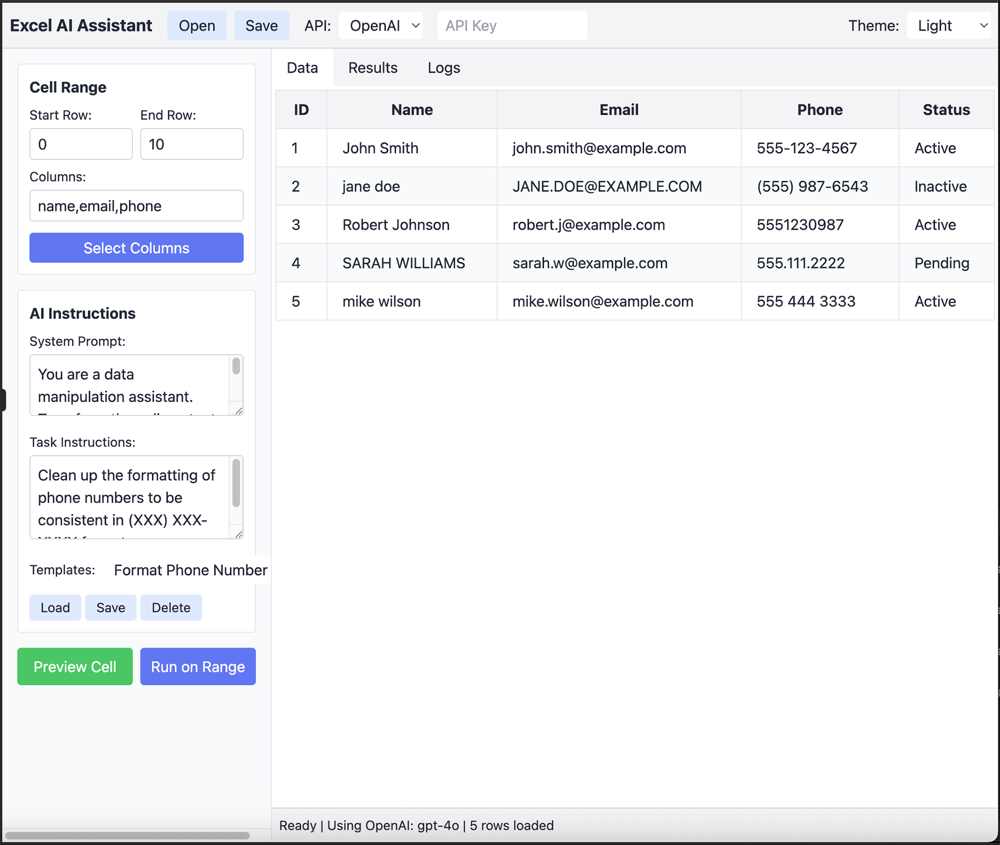
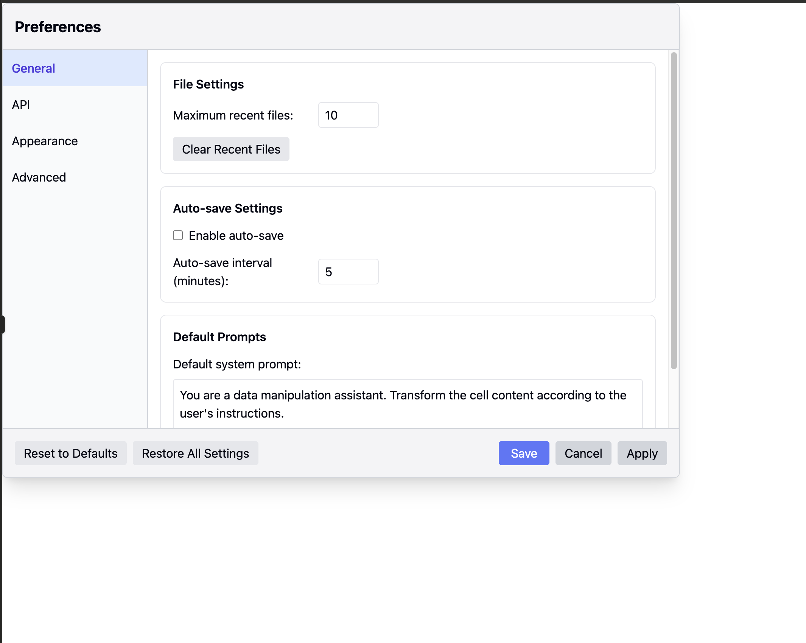
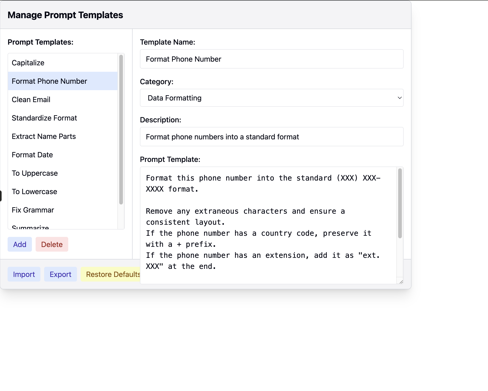
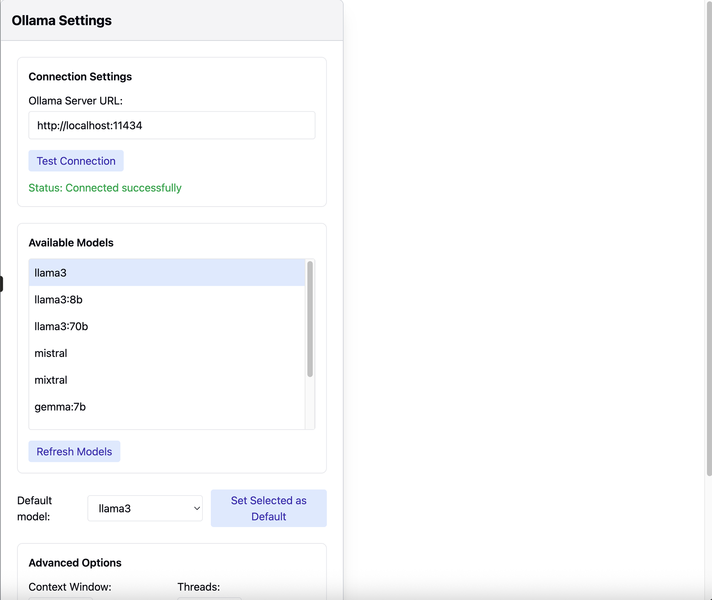

# Excel AI Assistant - Web Interface Mockups

This gallery contains design mockups for a potential web application version of the Excel AI Assistant. These mockups represent conceptual designs that showcase how the current desktop application's functionality could be translated into a web-based interface.

> **Note:** These are only design concepts and not screenshots of the actual application. The current Excel AI Assistant is a desktop application built with Python and Tkinter.

## Main Interface

The main interface concept shows a clean, modern layout with:
- A toolbar for file operations and API selection
- A control panel for setting ranges and configuring AI instructions
- A data view with tabs for original data, results, and logs
- A responsive design that works in both light and dark modes

## Preferences Dialog

The preferences dialog mockup demonstrates:
- Tabbed interface for organizing different settings categories
- Intuitive controls for configuring application behavior
- Responsive layout with clear sectioning of related options
- Buttons for saving, restoring defaults, and canceling changes

## Prompt Templates Manager

The prompt templates manager concept showcases:
- A side-by-side layout with template list and editor
- Controls for adding, editing, and deleting templates
- Structured template editing with name, category, and content fields
- Import/export functionality and a "Restore Defaults" option

## Ollama Settings

The Ollama integration settings mockup illustrates:
- Connection configuration for local Ollama server
- Model selection interface with refresh capability
- Default model setting options
- Advanced configuration options for fine-tuning model behavior

## About These Mockups

These mockups were created to visualize how the Excel AI Assistant might look if developed as a web application. The current application is a desktop tool built with Python, but these designs could inform future development directions.

The mockups maintain the core functionality of the existing tool while adopting web UI conventions:
- Clean, modern interface with consistent styling
- Responsive design elements that adapt to different screen sizes
- Familiar layout patterns that would be intuitive for users of the desktop application
- Support for both light and dark themes

These designs are purely conceptual and may not reflect the final implementation of any future web version of the Excel AI Assistant.